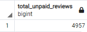

# Amazon Vine Analysis
In this module, we learned about BigData concepts and popular tools/platforms used to analyze data in the big data space. 

## Overview
For this module's challenge, we analyzed Amazon product reviews to understand if there is a bias toward favorable reviews from Vine members. This analysis focused only on the Major Appliance reviews data available at the following location:
https://s3.amazonaws.com/amazon-reviews-pds/tsv/amazon_reviews_us_Major_Appliances_v1_00.tsv.gz

We performed the ETL activities in the following interactive Python notebook file: [Amazon Reviews ETL](Amazon_Reviews_ETL.ipynb)

We executed our ETL in the [Google Colab](https://colab.research.google.com/) space and stored the data in a PostgreSQL database in Amazon Web Services.

1. The data was extracted and stored into Spark DateFrame.
2. The data was then transformed and summarized into several DataFrames that matched our tables.
3. The data was then loaded into our relational database for analysis.

We then performed all our analysis of the reviews data with the following SQL script in pgAdmin: [Vine Review Analysis](Vine_Review_Analysis.sql)

The reviews data that was analyzed can be found in the following CSV: [reviews](vine_table.csv)

## Results
1. Number of reviews
   - Vine: 35
   
     
   - Non-Vine: 4957
   
     
2. Number of 5-star reviews
   - Vine: 18
   
     
   - Non-Vine: 1963
   
     
3. Percentage of 5-star reviews
   - Vine: 51.43%
   
     
   - Non-Vine: 39.60%
   
     

## Summary
Due to the low number of Vine program reviews of Major Appliances, it is difficult to conclude with certainty that there is bias in 5-star reviews with Vine program reviewers. The limited number of reviews (35) certainly hints that there is bias, but we would need more samples to conclude with confidence. Once we obtain more samples, we could also compare all ratings' averages instead of just the percentage of 5-star reviews. There is a possibility that Vine program reviews follow a bimodal distribution and non-Vine program reviews follow a typical normal distribution. The average rating will most likely be the best way to determine if there is bias with Vine program reviews in the Major Appliances category.
